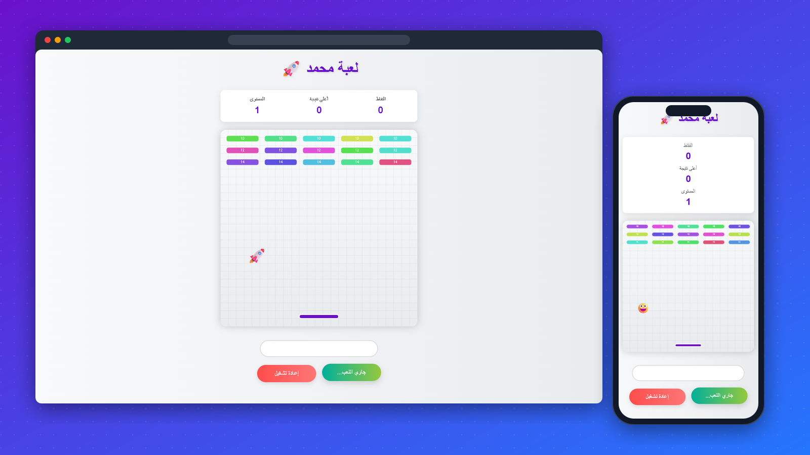

# 🚀 Emoji Breakout

**A Breakout-style arcade game on HTML canvas, where the ball is an emoji.**

## 🎮 How to play

Move the paddle to keep the emoji bouncing and break every block to reach the next level.

| | Desktop | Phone |
|---|---|---|
| Move | ← and → | Touch and slide |
| Start / restart | the buttons under the board | same |

## ✨ Features

- **Levels** that get harder: the ball speeds up and the paddle shrinks. Your **high score** is saved in the browser
- **Sound effects** for start, level up and game over
- **Touch controls** so it plays on phones
- **Hidden cheat codes** with special effects; try typing in the box under the board 👀

## ▶️ Run it

No build step. Open `index.html` in a browser.

---

Made by <a href="https://github.com/Mo1Amin">Mohamed Amin</a>

