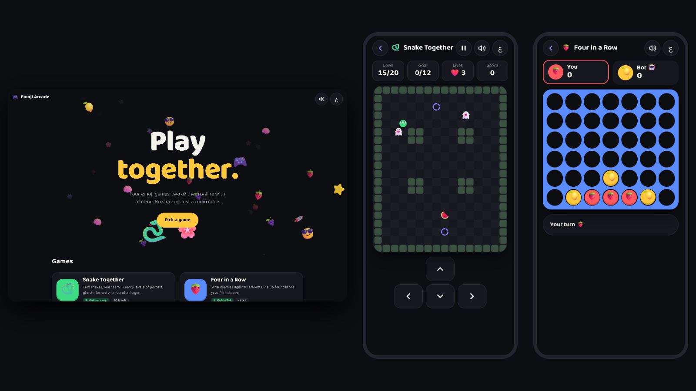

<div align="center">

# 🎮 Emoji Arcade

**Four emoji games for the browser, made for phones first. Two of them are online with a friend: no sign-up, just a room code.**

[](https://mo1amin.github.io/emoji-breakout/)




</div>

## 🕹️ The games

| | Game | Players | What makes it |
|---|---|---|---|
| 🐍 | **Snake Together** | 1–2, online co-op | 20 levels, each with a new idea: portals, gold, mushrooms that flip your controls, mines, guards, a locked vault that needs both players on its plates, darkness, a maze, a clock, meteors, a shrinking ring, ghosts, and a dragon at the end. When your friend crashes, reach their 🆘 to bring them back without losing a life. |
| 🍓 | **Four in a Row** | 1–2, online 1v1 | Strawberries against lemons. Play online, on one phone, or against a bot that searches five moves ahead. Throw emoji reactions at your friend while they think. |
| 🚀 | **Emoji Breakout** | 1 | The original game, rebuilt: ten brick patterns that loop faster, tough bricks, and power-ups (🍄 wide, 🔥 fireball, ⭐ extra balls, 🐌 slow, ❤️ life). The secret codes are still there; the 🔑 button takes them. |
| 🧠 | **Emoji Memory** | 1 | Eight boards from 6 to 36 cards, a quick look before they flip, and up to three stars per board. |

## 🌐 How online play works

There is no game server. One player creates a room and gets a four-letter code; the other types it in or opens the shared link. [PeerJS](https://peerjs.com/)'s public broker introduces the two browsers, and from then on the game runs over a WebRTC data channel, phone to phone.

- **Snake** runs on the host. The guest sends its turns and draws the snapshots the host sends back, so the two screens never disagree about who ate what.
- **Four in a Row** sends each move, and both sides check the move is legal and in turn before playing it.
- A heartbeat notices a friend who locked their phone or lost signal, and offers to carry on alone.

## ✨ Details

- Arabic (right to left) and English, switchable on every page
- Light and dark themes that follow the system
- Touch first: swipe or a d-pad for Snake, drag for Breakout, big targets everywhere
- Progress, stars and the Breakout high score are saved in the browser
- `prefers-reduced-motion` is respected, including the flight into a game from the home page

## ▶️ Run it

No build step, but the pages use ES modules, so serve the folder instead of opening the file:

```bash
npx serve .
# or
python -m http.server
```

---

<div align="center">Made by <a href="https://github.com/Mo1Amin">Mohamed Amin</a></div>
